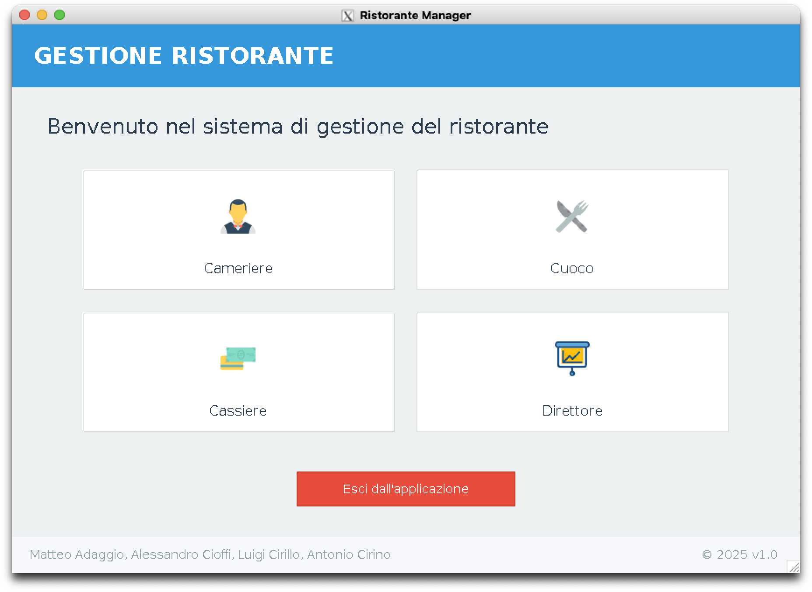
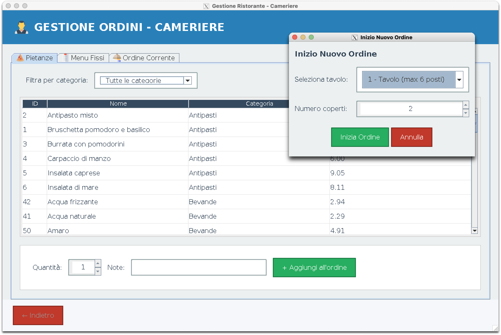
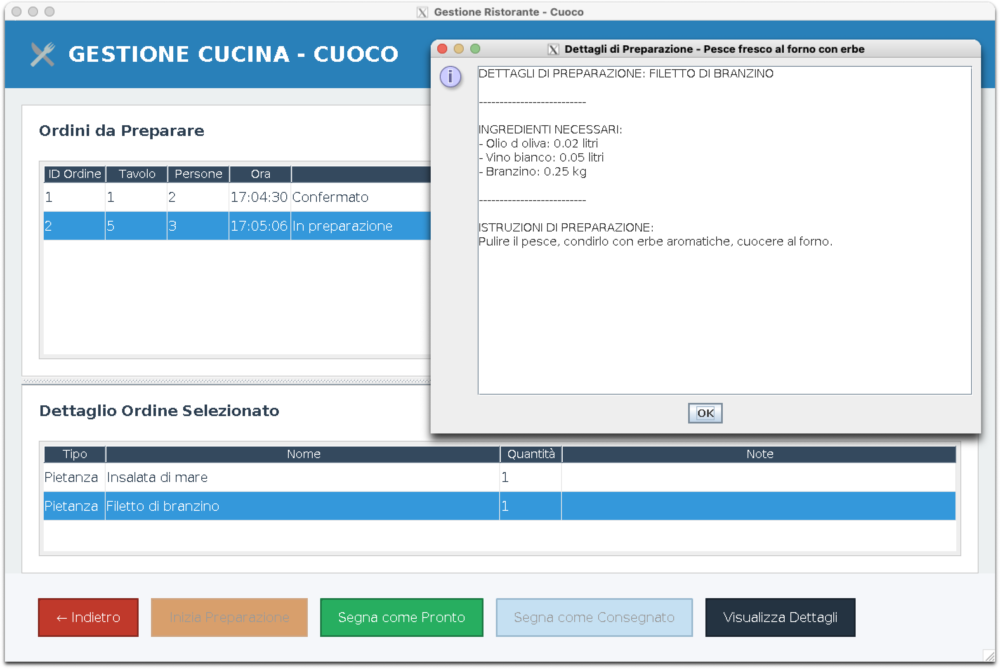
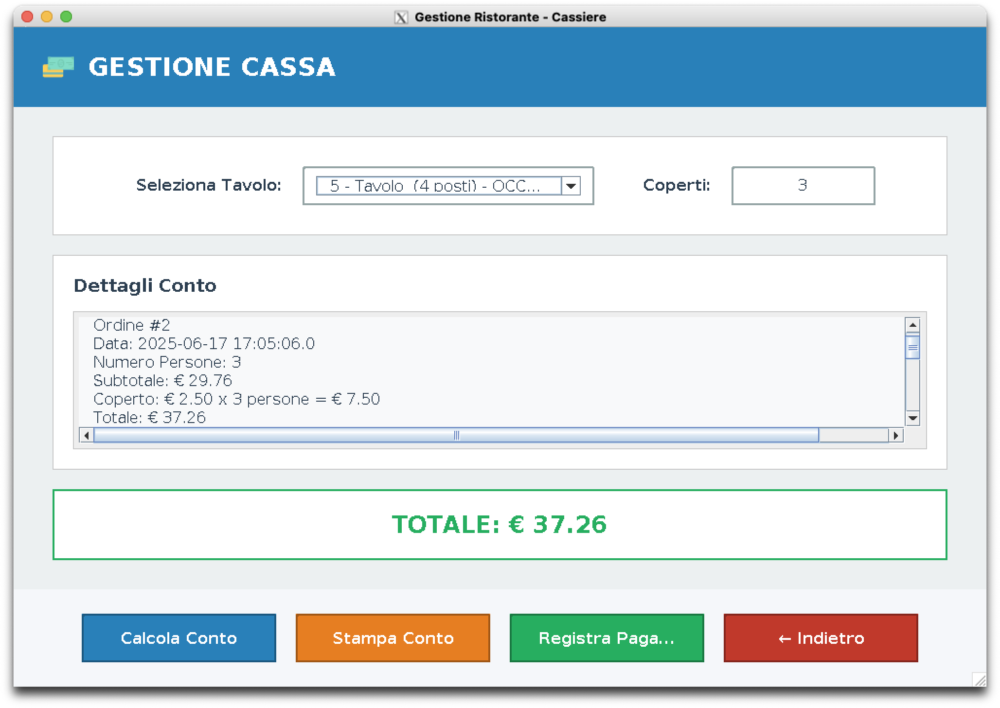
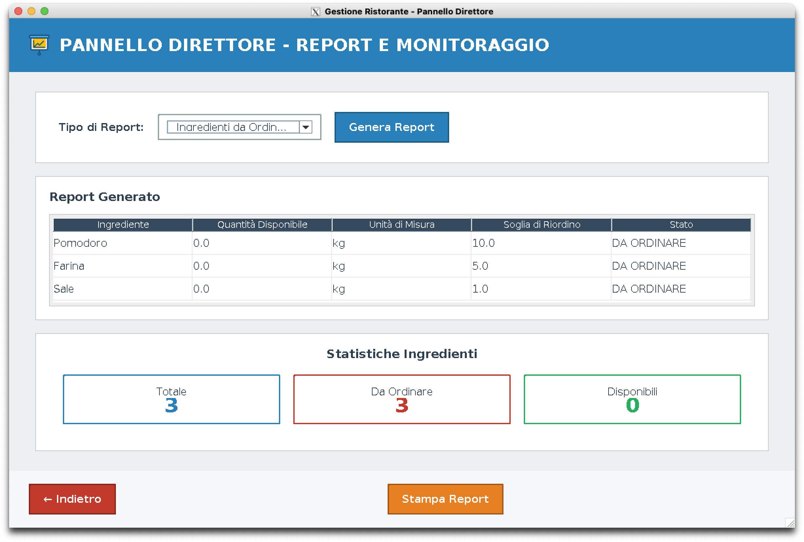

# 🍽️ Sistema di Gestione per Ristorante

> Progetto sviluppato per il corso di Ingegneria del Software.  
> Linguaggio di programmazione utilizzato: **Java**  
> Database: **Relazionale (MySQL)**  
> Architettura: **BCED (Boundary Control Entity Database)**  
> Containerizzazione: **Docker**

---

## 📁 Struttura del Progetto

```bash
.
├── GestioneRistorante/
│   ├── src/
│   │   ├── boundary/   #Contiene le classi per l'interfaccia utente e gestione dell'input/output
│   │   ├── CFG/        #Connessione al database
│   │   ├── control/    #Implementa la logica di stampa PDF e coordina le operazioni
│   │   ├── database/   #Gestisce le query al database MySQL
│   │   ├── DTO/        #Data Transfer Objects per il trasferimento di dati tra i vari strati
│   │   ├── entity/     #Definisce le entità di dominio e loro relazioni
│   │   ├── Exceptions/ #Contiene le classi per la gestione personalizzata delle eccezioni
│   │   ├── resources/  # Risorse statiche come immagini, icone e file di testo
│   │   └── test/       # Test unitari e di integrazione
│   └── bin/
├── SQL/
│   ├── init/
│   └── seeding/
├── docker/
├── images/
└── pom.xml
```

### Architettura BCED

Il progetto implementa l'architettura BCED (Boundary Control Entity Database):

- **Boundary**: Gestisce l'interazione con l'utente attraverso l'interfaccia grafica Swing
- **Control**: Implementa la logica di business e coordina il flusso tra interfaccia e dati
- **Entity**: Rappresenta le entità del dominio e le loro relazioni
- **Database**: Gestisce la persistenza dei dati attraverso il database MySQL

Questa architettura favorisce la separazione delle responsabilità e migliora la manutenibilità
del codice.

## 🔧 Tecnologie & Librerie

- **Java 11** → Linguaggio di programmazione principale del progetto
- **MySQL 8.0** → Sistema di gestione database relazionale per la persistenza dei dati
- **Swing** → Libreria grafica Java per la creazione dell'interfaccia utente
- **JDBC 8.0.26** → Connettore Java per l'interazione con il database MySQL
- **Docker 20.10** → Piattaforma per la containerizzazione dell'applicazione

## 📋 Funzionalità e Schermate

### FirstForm

La schermata iniziale consente ad ogni tipo di utente (cameriere, cuoco, cassiere, direttore)
l'accesso alle funzionalità appropriate per il proprio ruolo.



### Form Cameriere

L'interfaccia del cameriere permette di gestire le ordinazioni dei clienti. È possibile
creare nuovi ordini, associarli ai tavoli, modificare elementi e inviare le richieste
direttamente alla cucina.



### Form Cuoco

Il modulo dedicato ai cuochi visualizza in tempo reale gli ordini ricevuti, organizzandoli
per tempo di attesa. Il cuoco può segnare i piatti come "in preparazione" o
"completati", aggiornando automaticamente lo stato dell'ordine e visualizzare dettagli relativi alle pietanze ordinate.



### Form Cassiere

L'interfaccia del cassiere gestisce i pagamenti e l'emissione degli scontrini. Il sistema
calcola automaticamente il conto in base agli ordini associati al tavolo, supportando la creazione PDF dello scontrino.



### Form Direttore

Il pannello amministrativo consente al direttore di monitorare l'andamento del ristorante e controllare le scorte.
Include strumenti per la generazione di report per gli ingredienti da riordinare.



## 🐳 Docker e Containerizzazione

Il progetto è completamente dockerizzato per facilitare l'installazione e garantire lo stesso ambiente di esecuzione su qualsiasi piattaforma. Include:

- Container per l'applicazione Java con interfaccia Swing
- Container per il database MySQL
- Container per phpMyAdmin (per la gestione web del database)

### Variabili d'ambiente

Il sistema utilizza variabili d'ambiente definite nel file `.env` per configurare l'applicazione:

```
# Database
DATABASE_URL=jdbc:mysql://db:3306/ristorante
DATABASE_USER=root
DATABASE_PASSWORD=password

# Porte
JAVA_APP_PORT=8090
PHPMYADMIN_PORT=8081
```

Puoi modificare queste variabili nel file `.env` per personalizzare la configurazione.

### Dettagli delle variabili d'ambiente

#### Database MySQL

- `MYSQL_ROOT_PASSWORD`: Password dell'utente root del database
- `MYSQL_DATABASE`: Nome del database
- `MYSQL_USER`: Nome dell'utente aggiuntivo (non utilizzato nella connessione attuale)
- `MYSQL_PASSWORD`: Password dell'utente aggiuntivo

#### Connessione Java al database

- `DATABASE_URL`: URL JDBC per la connessione al database
- `DATABASE_USER`: Utente per la connessione al database (impostato su root)
- `DATABASE_PASSWORD`: Password per la connessione al database

#### Porte

- `PHPMYADMIN_PORT`: Porta per accedere a phpMyAdmin
- `JAVA_APP_PORT`: Porta esposta per l'applicazione Java

---

## 📋 Requisiti

- **macOS**:

  - Docker Desktop
  - XQuartz (per l'interfaccia grafica)

- **Windows**:
  - Docker Desktop
  - VcXsrv Windows X Server (per l'interfaccia grafica)

## 🚀 Come Eseguire il Progetto

### Metodo 1: Avvio Rapido con Ricostruzione (consigliato per prima installazione)

#### Per macOS

```zsh
chmod +x avvia-app-rebuild.sh
./avvia-app-rebuild.sh
```

Questo script si occuperà di:

- Configurare X11 (XQuartz) per la visualizzazione dell'interfaccia grafica
- Fermare eventuali container in esecuzione
- Ricostruire i container (elimina anche i dati esistenti)
- Mostrare i log dell'applicazione

#### Per Windows

1. **Compila l'applicazione Java** (usa Git Bash o WSL):

   ```sh
   chmod +x compile.sh
   ./compile.sh
   ```

2. **Costruisci e avvia i container**:
   ```sh
   docker compose build --no-cache
   docker compose up -d
   ```
   Se tutto è configurato correttamente, la GUI Java Swing apparirà automaticamente sul desktop di Windows tramite VcXsrv.

### Metodo 2: Avvio Manuale Passo-Passo

#### 1. Compilazione dell'applicazione

Prima di avviare i container, compila l'applicazione:

```zsh
chmod +x compile.sh
./compile.sh
```

#### 2. Configurazione X11 per l'interfaccia grafica (solo per macOS)

```zsh
chmod +x setup-x11-macos.sh
./setup-x11-macos.sh
```

#### 3. Avvio dei container Docker

```zsh
chmod +x docker-utils.sh
./docker-utils.sh start
```

Questo comando avvierà:

- Un container MySQL con il database ristorante
- Un container per l'applicazione Java con GUI
- Un container phpMyAdmin per gestire facilmente il database

### 4. Gestione del sistema

Utilizza lo script `docker-utils.sh` per gestire facilmente tutti gli aspetti del sistema:

```zsh
# Per vedere i log dell'applicazione
./docker-utils.sh logs

# Per riavviare i container (mantenendo i dati)
./docker-utils.sh restart

# Per vedere lo stato dei container
./docker-utils.sh status

# Per accedere alla console MySQL
./docker-utils.sh db-console
```

### 5. Accesso a phpMyAdmin

Per gestire il database tramite interfaccia web, accedi a:

- URL: http://localhost:8081
- Username: root
- Password: password

### 6. Arresto dei container

```zsh
./docker-utils.sh stop
```

Per rimuovere anche i volumi (dati del database):

```zsh
./docker-utils.sh rebuild
```

## ⚠️ Risoluzione dei problemi comuni

### 1. Interfaccia grafica non visibile

Se l'interfaccia grafica non appare:

```zsh
# Riconfigurare X11 e riavviare i container
./setup-x11-macos.sh
./docker-utils.sh restart

# Controllare i log per eventuali errori
./docker-utils.sh logs
```

Su **_macOS_** se l'interfaccia grafica non appare ma i container si avviano correttamente:

```zsh
export DISPLAY=:0
```

oppure

```zsh
export DISPLAY=localhost:0
```

### 2. Problemi di connessione al database

```zsh
# Controlla i log del database
./docker-utils.sh db-logs

# Verifica se il container database è in salute
./docker-utils.sh status

# In caso di persistenti problemi, ricostruisci i container
./avvia-app-rebuild.sh
```

### 3. Errori durante la compilazione

- Verifica di avere installato JDK 11 o superiore: `java -version`
- Controlla eventuali errori nei sorgenti Java
- Verifica che il driver MySQL sia stato scaricato correttamente in `GestioneRistorante/bin/jars/`

## 📚 Documentazione Aggiuntiva

Per informazioni più dettagliate, consultare i seguenti documenti:

- **[GUI-Docker.md](GUI-Docker.md)**: Guida dettagliata per la configurazione dell'interfaccia grafica in Docker per macOS e Windows
- **[TESTING.md](TESTING.md)**: Guide per testing e configurazione dell'ambiente di sviluppo, inclusa la configurazione di IntelliJ IDEA

## 🧠 Autori

- **[Matteo Adaggio](https://github.com/matteoadaggio)**
- **[Alessandro Cioffi](https://github.com/MisterCioffi)**
- **[Luigi Cirillo](https://github.com/GGCIRILLO)**
- **[Antonio Cirino](https://github.com/antocirino)**
